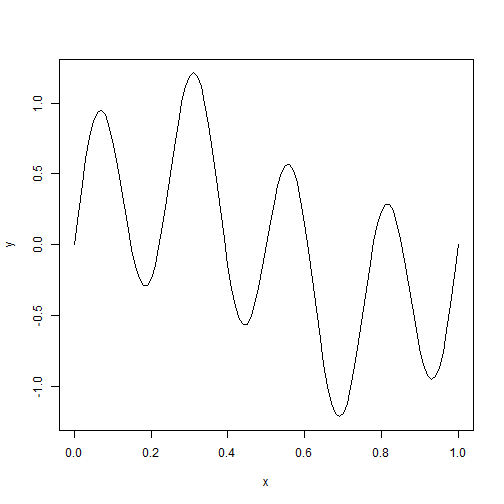

Developing Data Product
========================================================
author: Uday Bhan Singh
date: Sunday, February 22, 2015

Goal of this presentation
========================================================
The aim of this presentation is to present the Shiny application that I created for the course project of the Creating Data Products course in the Data Science Specialization.

Application description
========================================================


The application illustrates the superposition of harmonic oscillations. The amplitude of six frequencies (a fundamental frequency and its first five integer multiples) can be set using sliders as input parameters, and the sum of the resulting superposition as well as the individual harmonics are plotted as the output of the application.

This work is publish at rpub. and can be accisible at
http://rpubs.com/publish/claim/61830/de12330c9c984c82b5f4daba8738c925
Underlying Code
========================================================
Here's some simplified example code from the application:

```r
x <- seq(from=0, to=1, by=0.01);
f1 <- 0.5; f4 <- 0.75;
y <- f1*sin(2*pi*x) + f4*sin(2*pi*4*x)
summary(x,y)
```

```
   Min. 1st Qu.  Median    Mean 3rd Qu.    Max. 
   0.00    0.25    0.50    0.50    0.75    1.00 
```
Plot
========================================================
 
